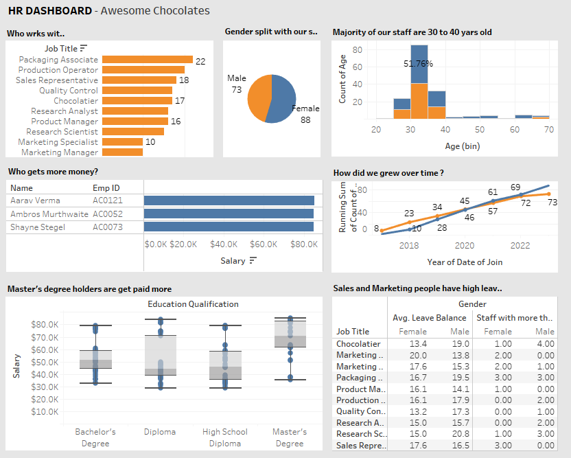

# HR-Dashboard
Tableau Project

## Project Overview
I’m excited to share my latest data visualization project—a comprehensive **HR Dashboard** built in Tableau for "Awesome Chocolates." This dashboard provides actionable insights into workforce demographics, salary distribution, educational qualifications, and leave trends to empower HR teams with data-driven decision-making.

### Key Features:
- **Workforce Breakdown:** Visualizes staff distribution by job title and gender.
- **Demographic Insights:** Highlights age groups, gender split, and staff growth over time.
- **Salary Analysis:** Compares compensation across education levels and job roles.
- **Leave Patterns:** Identifies trends in leave balances for sales and marketing teams.

This project showcases my skills in data analysis, visualization, and storytelling using Tableau to improve organizational effectiveness.

---
## Dashboard Preview

---

## Hashtags

#Tableau #DataVisualization #HRAnalytics #DashboardDesign #DataAnalysis #BusinessIntelligence #TableauPublic #HRDashboard #TableauSkills
